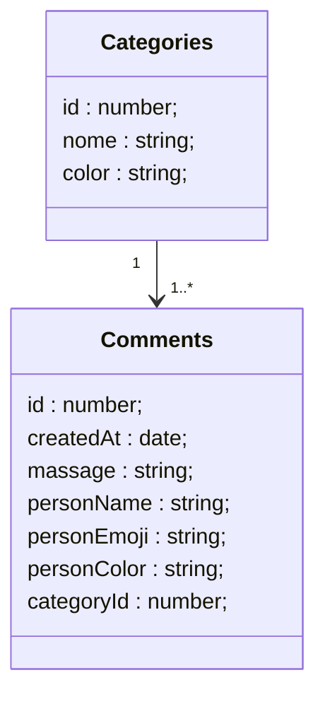

```mermaid
classDiagram

class Categories{

 id : number;
 nome : string;
 color : string;

}

Categories "1" --> "1..*" Comments

class Comments {

    id : number;
    createdAt : date;
    massage : string;
    personName : string;
    personEmoji : string;
    personColor : string; 
    categoryId : number;

}


```